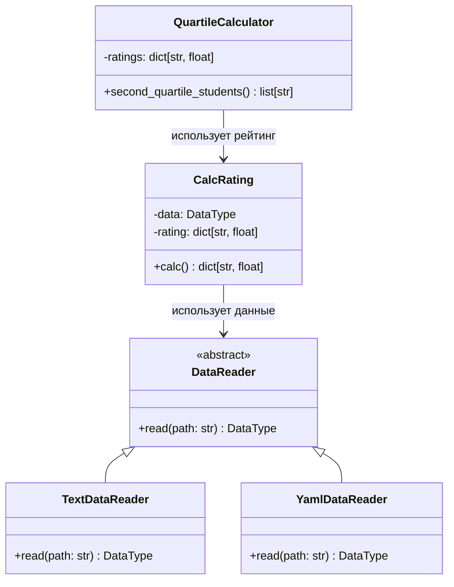

# Лабораторная 1 по дисциплине "Технологии программирования"

---

## Цель работы
1. Освоить основы работы с системой контроля версий **Git**.  
2. Научиться использовать **GitHub** для хранения проектов.  
3. Освоить механизм автоматического тестирования и проверки стиля кода через **GitHub Actions (CI/CD)**.  
4. Реализовать индивидуальное задание с использованием языка **Python** и модульного тестирования (**pytest**).  

---

## Постановка задачи
Базовый проект: система расчёта среднего рейтинга студентов по дисциплинам.  
Данные студентов и их оценки хранятся в файлах. Поддерживаются различные форматы входных данных (txt, yaml).  

Индивидуальный вариант **№8**:  
- Формат входного файла: **YAML**  
- Расчётная процедура: **определить и вывести всех студентов, чей рейтинг попадает во вторую квартиль распределения**.  

---

## Структура проекта
```
rating/
 ├── .github/workflows/github-actions-testing.yml   # CI/CD
 ├── data/
 │    ├── data.txt
 │    └── data.yaml
 ├── src/
 │    ├── CalcRating.py
 │    ├── DataReader.py
 │    ├── TextDataReader.py
 │    ├── YamlDataReader.py
 │    ├── QuartileCalculator.py
 │    ├── Types.py
 │    └── main.py
 ├── test/
 │    ├── test_CalcRating.py
 │    ├── test_TextDataReader.py
 │    ├── test_YamlDataReader.py
 │    ├── test_QuartileCalculator.py
 │    └── test_main.py
 ├── requirements.txt
 ├── .gitignore
 ├── LICENSE
 └── README.md
```

---

## Используемые технологии
- Язык программирования: **Python 3.10+**  
- Управление зависимостями: **requirements.txt**  
- Модульное тестирование: **pytest**  
- Проверка стиля кода: **pycodestyle (PEP8)**  
- CI/CD: **GitHub Actions**  

---

## Инструкция по запуску

### Установка зависимостей
```bash
pip install -r requirements.txt
```

### Проверка стиля кода (PEP8)
```bash
pycodestyle src test
```

### Запуск тестов
```bash
pytest test
```

### Запуск программы
- Для текстового формата:
```bash
python src/main.py -p data/data.txt
```

- Для YAML-формата (вариант 8):
```bash
python src/main.py -p data/data.yaml --yaml
```

---

## UML-диаграмма классов


---

## Выводы
В ходе выполнения лабораторной работы были освоены:  
- базовые команды **Git** и принципы работы с репозиторием на GitHub,  
- настройка CI/CD через **GitHub Actions**,  
- применение **pytest** для модульного тестирования,  
- контроль качества кода с помощью **pycodestyle**,  
- работа с различными форматами данных (**txt, yaml**),  
- реализация алгоритма для вычисления **второй квартиль** в распределении рейтингов студентов.  
Проект успешно протестирован и соответствует требованиям.  
